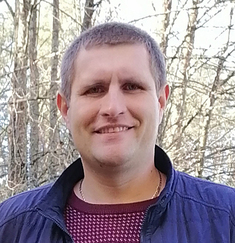

# Curriculum-vitae
CV https://jenyded.github.io/YOUR-REPO-NAME/
# 📝 Eugene Dedkov

## 🌟 About Me
Highly motivated and dedicated **Unity Developer** with a strong passion for game development.

🔹 **Specialties**: C#, Unity, Git, Game Mechanics, UI/UX, ECS, Zenject, UniRx  
🔹 **Tools**: Photoshop, Figma, DOTween, Timeline  
🔹 **Soft Skills**: Teamwork, Problem-Solving, Continuous Learning  

[📄 View My CV](https://jenyded.github.io/YOUR-REPO-NAME/index.html)  

---

## 🎓 Education
🎓 **Gomel State University**, Belarus *(2008)*  
🎓 **Gomel State College of Design and Computer Graphics**, Belarus *(2003)*

---

## 🔧 Skills
- C#, Unity, Git
- Game mechanics, animations, UI/UX
- ECS (LeoECS), Dependency Injection (Zenject), Reactive Programming (UniRx)
- Photoshop, Figma

---

## 💼 Work Experience
### Unity Developer – **Azia Development Studio**
- Worked on [Teddy's Button THE GAME](https://github.com/ADS-GAME/Teddy-s-button) *(Match-3 ECS-based game)*
- Participated in **Diablo Survival** development
- Developed [Cell_Game](https://github.com/Jenyded/Cell_Game)

---

## 🎮 Published Games
| Game               | Link  | Description  |
|-------------------|-----------------------------|---------------------------------|
| **Theater of Senses** | [Play Store](https://play.google.com/store/apps/details?id=theaterofsenses) | A collection of interactive stories... |
| **Formless** | [Play Store](https://play.google.com/store/apps/details?id=Formless) | A small experimental game... |

---

## 📚 Courses & Training
- **METANIT.COM** – C# *(2023)*
- **C# from Zero to Pro**
- Various self-learning resources

---

## 🎯 Career Goals & Expectations
🔹 Gain additional commercial experience in **game development**  
🔹 Work on exciting projects and **deliver high-quality games**  
🔹 Grow as a **Unity expert** and contribute to a **strong development team**  

---

📧 **Contact me**: [Email](mailto:jenik.byg@gmail.com) | [GitHub](https://github.com/Jenyded) | [Telegram](https://t.me/Evgenyided)
